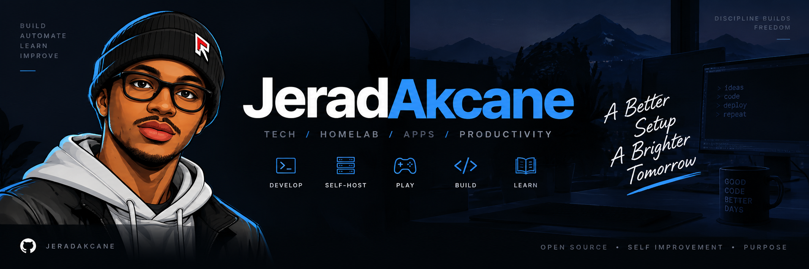

<h1 align="center">Hi 👋, I'm Jeremiah Akpor</h1>

<h3 align="center">
Computer Science Graduate • Software Developer • Linux & Self-Hosting Enthusiast
</h3>

  Building software, learning by creating, and exploring the systems behind modern applications.

---

## 👨‍💻 About Me

I'm **Jeremiah Akpor**, a Computer Science graduate with a strong interest in software development, full-stack web development, Linux, self-hosting, networking, and open-source technology.

I enjoy learning by building real projects and experimenting with the technologies I use.

I'm also the developer behind **[JeradAkcane](https://github.com/JeradAkcane)** — my developer brand for software projects, open-source work, self-hosted systems, and technical content.

- 🔭 Currently building and improving software projects
- 🌱 Learning and working with **React, TypeScript, Next.js, Python, and modern web development**
- 🐧 Daily Linux user with an interest in infrastructure and self-hosting
- 🖥️ Running and experimenting with homelab infrastructure and services
- ⚙️ Interested in automation, networking, developer tooling, and open source
- 💼 Currently preparing for software development and broader IT opportunities
- 📫 Reach me at **Jeremiahakpor_CS@outlook.com**

---

## 🚀 What I'm Working With

### Development

  
  
  
  
  
  
  

### Systems & Tools

  
  
  
  

Other areas I work with:

- Linux
- Proxmox
- Containers
- Self-hosting
- Networking
- Automation
- Homelab infrastructure
- Open-source software

---

## 🧪 Current Focus

I'm currently focused on:

- Full-stack web development
- React / TypeScript / Next.js
- Python
- Building portfolio-ready projects
- Improving software engineering fundamentals
- Self-hosted infrastructure
- Automation and developer tooling

---

## 🌐 JeradAkcane

**JeradAkcane** is my developer brand and the home for my public software projects, open-source work, technical experiments, and future content.

👉 [github.com/JeradAkcane](https://github.com/JeradAkcane)

🌐 Website — Coming soon

📺 YouTube — JeradAkcane

---

## 🤝 Connect With Me

  

📧 **Jeremiahakpor_CS@outlook.com**

---

  <strong>Build. Learn. Improve.</strong>

